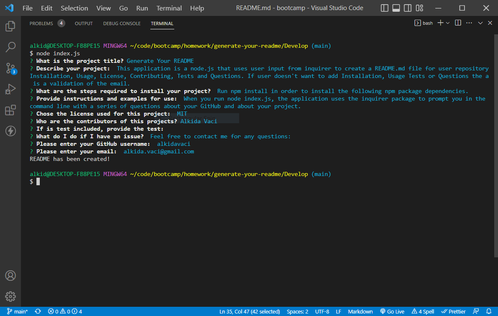
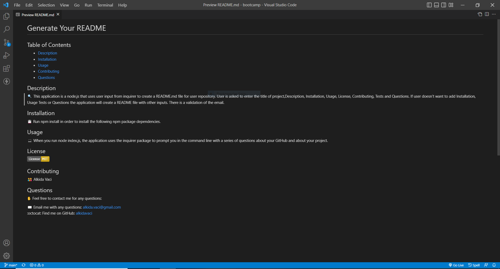

# Generate Your README
   
  ## Table of Contents
  - [Description](#description)
  - [Installation](#installation)
  - [Usage](#usage)
  - [Contributing](#contributing)
  - [Questions](#Questions)
  

  ## Description
  🔍 This application is a node.js that uses user input from inquirer to create a README.md file for user repository. User is asked to enter the title of project,Description, Installation, Usage, License, Contributing, Tests and Questions. If user doesn't want to add Installation, Usage Tests or Questions the application will create a README file with other inputs. There is a validation of the email.

  
  ## Installation
  💾 Run npm install in order to install the following npm package dependencies.
    

  
  ## Usage
  
   
  💻 When you run node index.js, the application uses the inquirer package to prompt you in the command line with a series of questions about your GitHub and about your project.
    

  ## License 
  
    
     
  ## Questions
  ✋ Feel free to contact me for any questions: 
  
  ✉️ Email me with any questions: [alkida.vaci@gmail.com](alkida.vaci@gmail.com) 
  :octocat: Find me on GitHub: [alkidavaci](https://github.com/alkidavaci)